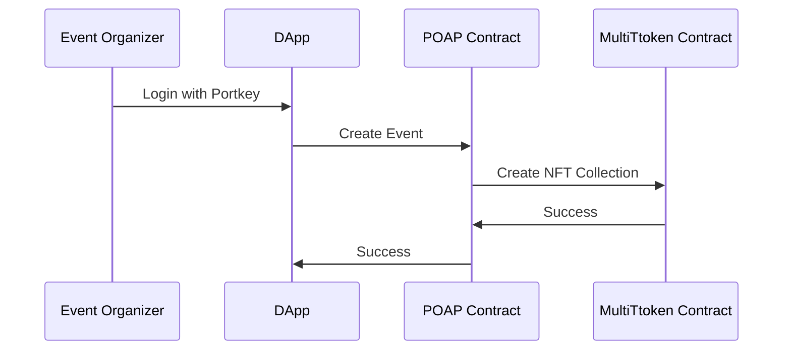
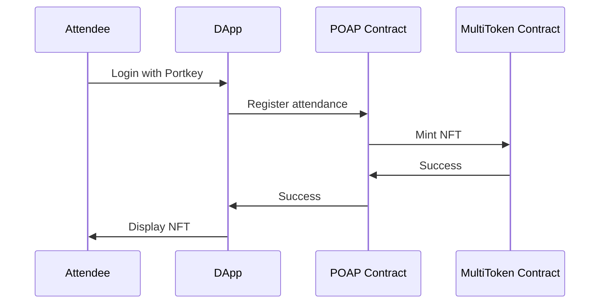

# Welcome to aelf NUS Workshop 2024

## Topics Covered

 1. How to issue tokens (FT and NFT) on aelf

 2. How to develop smart contracts on aelf

 3. How to develop dApp on aelf

## Mode of Workshop
We will be covering the topics by developing a simple `POAP (or Proof of Attendance Protocol)` application on top of aelf.

### 1. What is a POAP?

POAP stands for "Proof of Attendance Protocol", and it refers to a type of non-fungible token (NFT) that is typically used to represent proof of attendance at a specific event. The concept behind POAP is to provide a unique and verifiable token to individuals who have participated in a particular gathering, conference, meetup, or any other event.

### 2. How POAP works?

- Event Organizers: The organizers of an event decide to implement POAP as a way to provide digital certificates of attendance.
- Smart Contracts: A smart contract is deployed on a blockchain (such as Ethereum or aelf) to handle the issuance of POAP tokens. This smart contract contains the logic for minting tokens and associating them with specific event attendees.
- Minting Tokens: When an individual attends the event, the event organizers or a designated entity mark the individual's attendance by interacting with the smart contract. This action triggers the minting of a unique POAP token for that attendee.
- NFTs for Attendees: Each POAP token is a non-fungible token (NFT), meaning it is unique and cannot be replicated. It serves as a digital certificate of attendance and is often represented by a visual or graphical design that is relevant to the event.
- Wallet Integration: Attendees can store their POAP tokens in compatible cryptocurrency wallets that support NFTs. This allows them to showcase their attendance credentials and share or display them as desired.
- Verification: The transparency and immutability of blockchain technology ensure that the authenticity of POAP tokens can be easily verified. Anyone can check the blockchain to confirm whether a particular POAP token was indeed issued for a specific event.

POAP tokens have gained popularity as a creative and engaging way to reward event participants, build a sense of community, and leverage blockchain technology for proof and verification purposes. They also serve as collectibles, with some individuals actively seeking out and collecting POAP tokens from various events they attend.

### 3. Create an event

:::info

MultiToken is singleton system smart contract on aelf used to host all tokens (FT and NFT). You don't need to deploy your own smart contract to issue your own tokens.

:::

### 4. Sequence diagram

