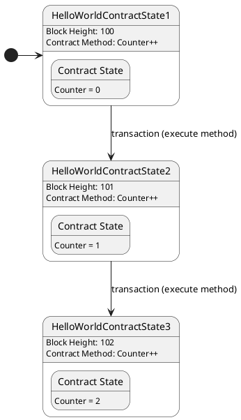
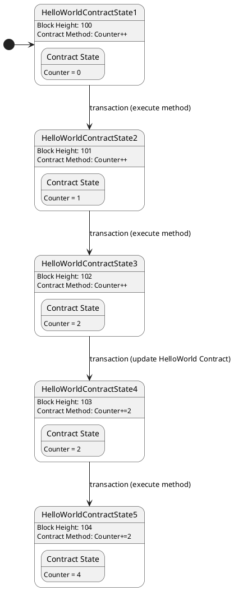

# What is State

Blockchain is a state transition system where an initial state in combination with a transaction has a new state as an output. The process of executing a transaction is actually the execution of a method implemented in the contract.

As shown in the above figure, we have a HelloWorld Contract that has a State called Counter. The logic for modifying the Counter state is defined in the Contract Method, and as the transaction calling this method is executed, the Counter's state also changes as the block height grows.

Once the implementation of Contract Method is updated (this can happen on aelf through an UpdateSmartContract transaction), the logic for modifying the Counter state changes when the method is called again through a transaction.

Therefore, it can be said that the code logic in the contract is mainly aimed at achieving one purpose: to inform the blockchain of how the state should be changed.

And these states happen to be defined within the contract. We also need to operate these states within the contract that defined the states.
